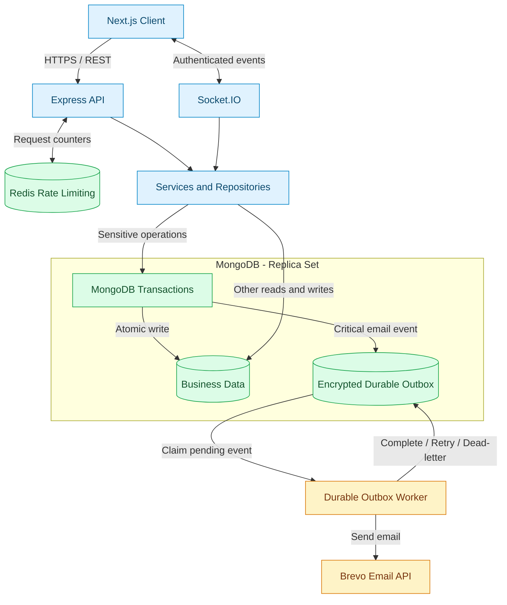

# عون — Aoun Backend

**الخادم الخلفي لمنصة عون لطلب وتنسيق التبرعات العينية**


[](https://github.com/abuhager/Aoun-Project_BackEnd/actions/workflows/ci.yml)

[تجربة المنصة](https://aoun-project-theta.vercel.app/) · [مستودع الواجهة](https://github.com/abuhager/Aoun-Project_FrontEnd) · [فحص حياة الخدمة](https://aoun-project-backend.onrender.com/health/live)

خدمة REST وSocket.IO لمنصة **عون**، وهي منصة عربية لتنظيم التبرعات العينية وطلبات الاحتياج والحجز والتسليم والمحادثات والإشراف.

> حالة المشروع: MVP منشور يستهدف تجربة Pilot محدودة. تعرض شارة CI أعلاه حالة سير العمل؛ نجاحها لا يغني عن التحقق التشغيلي قبل التجربة. بيانات Demo مخصصة للاختبار والعرض ولا تمثل مستخدمين أو شراكات حقيقية.

## المشكلة والحل

عندما تتوزع عروض التبرع وطلبات الاحتياج بين منشورات ومحادثات منفصلة، يصبح تتبع توفر الغرض والحجز والتسليم أصعب على الأطراف والجهات المشرفة.

تجمع **عون** هذه الخطوات في رحلة واحدة: عرض أو طلب، ثم حجز وتواصل وتسليم وتقييم، مع صلاحيات واضحة وإشراف إداري. تركز المنصة على **التبرعات العينية**، ولا تجمع تبرعات مالية أو تنفذ عمليات دفع.

| الطرف | القيمة التي تقدمها عون |
| --- | --- |
| المتبرع | عرض الأغراض ومتابعة الحجز والتواصل حتى التسليم |
| طالب الاحتياج | تصفح الأغراض أو نشر طلب ومتابعة الاستجابة |
| الجهة المشرفة | إدارة البلاغات والإعدادات ومراجعة النشاط من لوحة موحدة |

## ما الذي يقدمه الخادم؟

- مصادقة آمنة وصلاحيات متعددة مع Access/Refresh tokens وتدوير رموز التجديد.
- دورة كاملة للأغراض والطلبات والعروض والحجز وقائمة الانتظار والتسليم والتقييم.
- محادثات وإشعارات فورية، وإشراف وبلاغات واعتراضات وسجل إداري.
- معاملات MongoDB للعمليات الحساسة وفهارس مدارة وأدوات تدقيق وترحيل آمنة.
- Durable Outbox مشفر للبريد الحرج مع retry وdead-letter handling.
- إعدادات ديناميكية، Rate Limiting، health checks، metrics اختيارية، واختبارات آلية.

## التقنيات والقرارات الهندسية

| الطبقة | التقنيات | الغرض |
| --- | --- | --- |
| اللغة والتشغيل | TypeScript، Native ESM، Node.js | فحص الأنواع وبناء نسخة تشغيل داخل `dist/` |
| واجهات الخدمة | Express 5، Socket.IO | REST والتواصل الفوري |
| البيانات | MongoDB، Mongoose | نمذجة البيانات والمعاملات والفهارس |
| حدود الطلبات | Redis، express-rate-limit | حفظ عدادات التقييد المشتركة عند تفعيل Redis |
| التكاملات | Brevo، Cloudinary | البريد الإلكتروني ورفع الصور |
| التحقق والتشغيل | Node Test Runner، GitHub Actions، Render | الاختبارات والبناء والنشر |

## المعمارية وتدفق البيانات

يوضح المخطط مسار HTTP والتواصل الفوري، ومسار حفظ البريد الحرج وإرساله في الخلفية. MongoDB هو مخزن الـOutbox؛ يستخدم Redis لتقييد الطلبات، وليس لتخزين طابور البريد في هذا التصميم.



- **اتساق البيانات:** تُنفّذ العمليات الحساسة داخل معاملات MongoDB؛ يُحفظ حدث البريد الحرج مع تغيير البيانات داخل المعاملة نفسها.
- **الإرسال الخلفي:** يلتقط العامل الحدث المحفوظ، ويفك تشفير محتواه ويرسله عبر Brevo، ثم يسجل النجاح أو إعادة المحاولة أو حالة الفشل النهائي.
- **التشغيل:** يعمل العامل مدمجًا في نمط `single`، أو مستقلًا في نمط `distributed`.
- **التواصل الفوري:** يستخدم Socket.IO المصادقة وصلاحيات المحادثات؛ يضاف Redis adapter عند التشغيل الموزع وفق إعدادات الإنتاج.
- **نطاق الرسم:** يركز على البيانات والبريد؛ تبقى تفاصيل Cloudinary وبقية المهام المجدولة في الكود ووثائق التشغيل.

## لقطات الشاشة

مساحة جاهزة لإضافة صور فعلية من بيئة العرض. أضف الصور إلى `docs/screenshots/` في هذا المستودع، أو استبدل المسارات بروابط الصور.

| اللقطة | ما الذي توضحه؟ | المسار المقترح |
| --- | --- | --- |
| استكشاف الأغراض | التصفح والبحث والتصفية | `docs/screenshots/browse.png` |
| تفاصيل الغرض والحجز | حالة الغرض وإجراء الحجز | `docs/screenshots/booking.png` |
| المحادثة | تنسيق التسليم بين الطرفين | `docs/screenshots/chat.png` |
| لوحة المتبرع | متابعة الأغراض والحجوزات | `docs/screenshots/donor-dashboard.png` |
| لوحة الإدارة | الإشراف والبلاغات والإعدادات | `docs/screenshots/admin-dashboard.png` |

<!--
بعد رفع الصور، أخرج أسطر الصور المطلوبة من هذا التعليق لتظهر في GitHub.
استخدم بيانات عرض خالية من معلومات المستخدمين الشخصية.


-->

## المتطلبات

- Node.js 20.19 أو أحدث.
- MongoDB Atlas أو MongoDB يعمل كـReplica Set؛ معاملات الحصص والحجز لا تدعم
  خادم MongoDB محليًا بوضع Standalone.
- Cloudinary لرفع الصور.
- Brevo للتحقق من البريد واستعادة كلمة المرور.
- Redis مُدار لتثبيت Rate Limiting وإدخاله ضمن readiness عند ضبط `REDIS_REQUIRED=true`.
- عامل Outbox مدمج عند تشغيل خدمة واحدة، أو Worker مستقل عند التشغيل الموزع.

## التشغيل المحلي

```bash
npm ci
npm run dev
```

التشغيل التطويري يستخدم `tsx` مباشرةً على ملفات TypeScript، ولا يحتاج بناء `dist` يدويًا.

أنشئ `.env` محليًا واضبط MongoDB وأسرار المصادقة وOrigins المسموحة وCloudinary وBrevo. لا ترفع `.env` أو أي مفتاح أو كلمة مرور إلى Git.
مرجع متغيرات الإنتاج غير السرية موجود في `.env.production.example`؛ استبدل كل القيم التجريبية داخل لوحة الاستضافة فقط.

لإرسال رمز التحقق فعليًا أثناء التطوير، يجب أن يحتوي `.env` على مفتاح Brevo وعنوان مرسل موثّق:

```env
BREVO_API_KEY=replace-with-your-brevo-key
PLATFORM_EMAIL=replace-with-a-verified-sender@example.com
```

في `NODE_ENV=development` يعمل عامل Outbox المدمج تلقائيًا بنمط `single` حتى لو لم تضع
`RUNTIME_TOPOLOGY` و`OUTBOX_WORKER_REQUIRED`. إذا ضبطت أحدهما صراحةً على
`distributed` أو `false`، شغّل العامل في نافذة ثانية باستخدام `npm run worker:dev`.
عند رفض Brevo للطلب سيظهر في الطرفية رمز واضح مثل `EMAIL_HTTP_401` بدل نجاح صامت.

### مستوى الثقة للحسابات الجديدة

- القيمة الافتراضية `NEW_USER_DEFAULT_TRUST_LEVEL_2=false` تُبقي الحساب العادي الجديد في المستوى 1.
- عند ضبطها على `true`، يبدأ **الحساب الذي يُنشأ بعد التفعيل فقط** في المستوى 2، مع بقاء التحقق من البريد إلزاميًا قبل تسجيل الدخول والحجز.
- لا تتغير الحسابات الموجودة عند تبديل القيمة، ولا تنخفض الحسابات التي أُنشئت سابقًا بالمستوى 2 عند إعادتها إلى `false`. يستطيع المشرف لاحقًا تغيير المستوى من لوحة الإدارة.

## التحقق

```bash
npm run verify
```

- `typecheck` و`check`: فحص أنواع TypeScript من دون إنشاء ملفات.
- `test`: اختبارات العقود والمسارات والأمان والانحدار.
- `build`: يبني JavaScript القابل للتشغيل داخل `dist/`.
- `verify`: يشغّل فحص الأنواع والاختبارات ونسخة الإنتاج بالتتابع.
- `db:indexes`: يزامن فهارس MongoDB المطلوبة بعد فحص التكرارات قبل إنشاء أي فهرس فريد.
- `db:indexes:verify`: يفحص الفهارس قراءةً فقط ولا يغيّر قاعدة البيانات.

## فحص أداء قصير وغير هدّام

```bash
npm run perf:smoke
```

يفحص قوائم الأغراض العامة على `http://127.0.0.1:5000`، بعد تشغيل Backend محليًا. لا يحتاج بيانات حساب، ولا يُرسل POST، ولا يمسح قاعدة البيانات. افتراضيًا يرسل 73 طلبًا كحد أقصى على مراحل تزامن `1,5,10,20`، ويتوقف عن بدء جولات إضافية عند الخطأ أو 429 أو تجاوز عتبة التأخير.

لفحص Render من PowerShell على جهازك، مع تأكيد الخادم المقصود:

```powershell
$env:LOAD_TEST_BASE_URL="https://aoun-project-backend.onrender.com"
$env:LOAD_TEST_CONFIRM_ORIGIN=$env:LOAD_TEST_BASE_URL
npm run perf:smoke
```

لا تشغّل الفحص أثناء استخدام حقيقي كثيف. ظهور 429 يعني احترام فترة التقييد، وليس تعطيل Rate Limiting أو تغيير IP لتجاوزه. الفحص لا يحدد عدد المستخدمين الأقصى ولا يغطي الجلسات والمحادثات والكتابة. التفاصيل والنتائج في [تقرير الأداء](docs/PERFORMANCE-SMOKE-REPORT.md)، وخطوات تطبيق الملفات في [دليل التنظيف الأخير](docs/FINAL-CLEANUP.md).

## بيانات Demo شاملة

الملف `scripts/seed-mock-data.ts` يتحقق أولًا من كل سجل باستخدام Mongoose ومن سلامة العلاقات، ثم يمسح قاعدة Demo كاملة ويعيد إنشاء الإعدادات والفهارس والبيانات.

يغطي الـSeed حسابات المستخدمين ونقاط التسليم والأغراض بكل حالاتها والطلبات والعروض والمحادثات والرسائل والإشعارات والتقييمات والبلاغات والاعتراضات وسجل الإدارة. يبقى حسابا الطالب والمتبرع الأساسيان بلا معاملات مسبقة حتى تعمل اختبارات QA04 عليهما.

**هذا الأمر هدّام لكل بيانات القاعدة المحددة في `.env`، بما فيها `SystemSettings`. لا تستخدمه على قاعدة حقيقية أو على بيانات تريد الاحتفاظ بها.**

ضع في `.env` لقاعدة Demo فقط:

```env
ALLOW_MOCK_RESET=true
MOCK_RESET_DATABASE_NAME=اسم_قاعدة_Demo_حرفيا
```

يجب أن يطابق `MOCK_RESET_DATABASE_NAME` اسم القاعدة التي اتصل بها Mongoose حرفيًا؛ يرفض السكربت المسح عند غياب المتغير أو اختلاف الاسم.

ثم شغّل:

```bash
npm run db:seed:mock
```

يعيد السكربت إنشاء:

- 12 مستخدمًا، منها حسابات Demo الأربعة الأساسية.
- 3 نقاط تسليم تجريبية و20 غرضًا تغطي `متاح/محجوز/تم التسليم/مخفي`.
- 5 طلبات و6 عروض تغطي الحالات المستقرة في دورة الطلب.
- 3 محادثات و7 رسائل و12 إشعارًا مقروءًا وغير مقروء.
- تقييمًا بعد تسليم مؤكد، و3 بلاغات، و5 سجلات إدارة.
- إعدادات النظام والفهارس المطلوبة بعد مسح القاعدة.

حسابات Demo الأساسية تبقى كما هي:

| الدور | البريد |
| --- | --- |
| المشرف | `mock.admin@aoun.test` |
| الطالب | `mock.student@aoun.test` |
| المتبرع | `mock.donor@aoun.test` |
| متبرع العرض | `mock.donor2@aoun.test` |

تُدار كلمة مرور Seed وحسابات العرض من بيئة الاختبار فقط. لا تضع بيانات الدخول أو الأسرار داخل ملفات المصدر أو README، ويمكن إدارة إظهار بطاقات الدخول من متغيرات بيئة الواجهة والخادم.

## بنية المشروع

```text
app.ts / server.ts       تركيب Express وتشغيل HTTP وSocket.IO
worker.ts                تشغيل عامل Outbox المستقل
config/                  البيئة وMongoDB وCORS وCloudinary
controllers/             معالجة طلبات HTTP
dtos/                    عقود الاستجابة الآمنة للخصوصية
integrations/            خدمات الطرف الثالث
jobs/                    المهام المجدولة
middlewares/             المصادقة والتحقق والأمان والرفع
models/                  مخططات Mongoose
repositories/            الوصول إلى البيانات
routes/                  مسارات REST
services/                قواعد العمل
socket/                  المصادقة والمحادثات الفورية
test/                    اختبارات التدفق والانحدار
utils/                   أدوات مشتركة
```

## الإنتاج

إعدادات Render المقترحة بعد انتقال الخادم إلى TypeScript:

```text
Build Command: npm ci && npm run build
Start Command: npm start
```

مع `RUNTIME_TOPOLOGY=single` يعمل Outbox Worker داخل Web Service نفسه، وهذا يناسب
خدمة Render واحدة. عند استخدام `RUNTIME_TOPOLOGY=distributed` فقط، أضف Background
Worker مستقلًا من نفس المستودع:

```text
Build Command: npm ci && npm run build
Start Command: npm run worker
```

- استخدم `RUNTIME_TOPOLOGY=single` و`WEB_CONCURRENCY=1` لنسخة واحدة. للتوسع
  الأفقي استخدم `RUNTIME_TOPOLOGY=distributed` مع `REDIS_REQUIRED=true`؛ عندها
  يعمل Socket.IO Redis adapter وdistributed invalidation وCron leadership.
- يبدأ HTTP فقط بعد نجاح اتصال MongoDB وتهيئة Cron Jobs. فشل jobs لم يعد يسمح بخادم يبدو جاهزًا.
- اضبط `OUTBOX_WORKER_REQUIRED=true` و`OUTBOX_ENCRYPTION_KEY` ثابتًا من 32 بايت. في نمط `single` يشغّل Web العامل المدمج؛ وفي `distributed` يجب أن تتطابق القيمة على Web وWorker المستقل. بريد OTP واستعادة كلمة المرور والتنبيهات الإدارية الحرجة يُحفظ مشفرًا مع تغيير قاعدة البيانات داخل transaction واحدة، ثم يرسله Worker مع retry وdead-letter state.
- `/health/ready` يفحص MongoDB وRedis وجدولة background jobs وheartbeat عامل Outbox عندما تكون مطلوبة، بينما `/health/live` يثبت فقط أن عملية Web تعمل.
- عند `METRICS_ENABLED=true` يوفّر `/metrics` عدادات HTTP وزمن الاستجابة وذاكرة العملية بصيغة Prometheus؛ في Production يلزم `METRICS_TOKEN` وإرساله كـBearer token.
- استخدم HTTPS وأسرارًا طويلة ومنفصلة لكل بيئة.
- اضبط Redis وCORS وCookie domains حسب النطاق المنشور.
- فعّل نسخ MongoDB الاحتياطية ومراقبة الأخطاء قبل Pilot حقيقي.
- راجع سياسات الخصوصية والشروط قانونيًا قبل أي تبنٍ مؤسسي واسع.

خطوات النشر والفحص والاسترجاع موثقة في [Production Runbook](docs/PRODUCTION-RUNBOOK.md).
وحالة تنفيذ كل بند من المراجعة موثقة في
[Review Remediation Status](docs/REVIEW-REMEDIATION-STATUS.md).

### تحقق CI الحقيقي

يشغّل GitHub Actions الآن MongoDB كـReplica Set وRedis حقيقيًا، ثم يطبق الفهارس ويفحصها ويثبت rollback/commit لمعاملة MongoDB و`PING/PONG` من Redis قبل نجاح `verify`. الاختبار المحلي يتخطى فحص الخدمات الخارجية افتراضيًا، ويمكن تشغيله على بيئة اختبار معزولة بضبط `RUN_RUNTIME_INTEGRATION=true`.

### ترحيل الفهارس بأمان

تعريفات الفهارس داخل `models/` هي المصدر الوحيد للحقيقة. التشغيل العادي في الإنتاج
لا ينشئ أو يحذف فهارس تلقائيًا، لذلك نفّذ الترحيل مرة واحدة قبل تفعيل بوابة التشغيل:

1. خذ نسخة احتياطية حديثة من قاعدة الإنتاج، ويفضّل التنفيذ في نافذة صيانة.
2. شغّل `npm run db:indexes` مع `MONGO_URI` الخاص بالإنتاج. تفحص المهمة التكرارات
   قبل إنشاء الفهارس الفريدة، وتتوقف من دون طباعة قيم البيانات المتكررة.
3. شغّل `npm run db:indexes:verify` للتأكد من تطابق القاعدة مع جميع الـschemas.
4. اضبط `MONGO_INDEXES_REQUIRED=true` و`MONGO_SYNC_INDEXES_ON_STARTUP=false` في الإنتاج.

إذا أبلغت المهمة عن بيانات مكررة، لا تحذف شرط `unique` ولا تجبر النشر. أوقف
الترحيل ونظّف السجلات المتعارضة يدويًا ثم أعد المحاولة. لا تفعّل
`MONGO_SYNC_INDEXES_ON_STARTUP=true` بشكل دائم في الإنتاج؛ المزامنة عملية ترحيل
مقصودة، بينما بوابة التشغيل تستخدم فحصًا للقراءة فقط.

### حماية الحدود من الطلبات المتزامنة

إنشاء الأغراض والطلبات والعروض والحجز وترقية قائمة الانتظار تستخدم MongoDB
transactions مع قفل كتابة داخلي على المستخدم. لذلك يجب أن يكون `MONGO_URI`
متصلًا بـAtlas أو Replica Set. الحقل الداخلي `operationVersion` يُنشأ تلقائيًا
عند أول عملية ولا يحتاج backfill أو migration بيانات منفصلة.

## التطوير والتواصل

طوّر المشروع [أدهم أبو حجر — Adham Abu Hager](https://github.com/abuhager). لاستكشاف تجربة المستخدم راجع [مستودع الواجهة](https://github.com/abuhager/Aoun-Project_FrontEnd)، وللاستفسار عن التعاون: [aoun.help.center@gmail.com](mailto:aoun.help.center@gmail.com).
