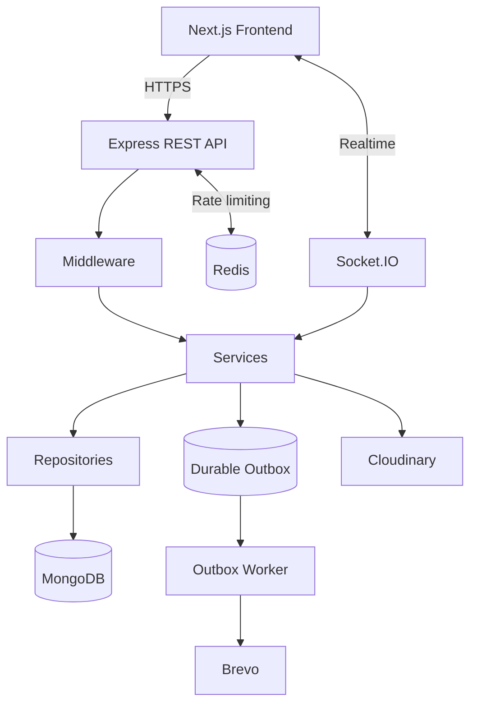

# عون | Aoun Backend

**REST API وخدمات الـBackend لمنصة عون لتنسيق التبرعات العينية.**

يوفر هذا المستودع منطق الأعمال، المصادقة والصلاحيات، الوصول إلى البيانات، الحجز وطلبات الاحتياج، المحادثات الفورية، الإشعارات والعمليات الإدارية التي تعتمد عليها واجهة عون.


[](https://github.com/abuhager/Aoun-Project_BackEnd/actions/workflows/ci.yml)

## روابط المشروع

- **Frontend Repository:** https://github.com/abuhager/Aoun-Project_FrontEnd
- **Live Application:** https://aoun-project-theta.vercel.app/
- **Backend Health Check:** https://aoun-project-backend.onrender.com/health/live

> المشروع MVP منشور. بيانات Demo المستخدمة للاختبار والعرض لا تمثل مستخدمين أو شراكات مؤسسية فعلية.

## نظرة معمارية

يتبع المشروع فصلًا واضحًا للمسؤوليات:

```text
HTTP Request
    ↓
Route
    ↓
Middleware
    ↓
Controller
    ↓
Service
    ↓
Repository
    ↓
MongoDB
```

- **Routes:** تعريف endpoints وربط middleware والـcontrollers.
- **Middlewares:** المصادقة، validation، rate limiting، الرفع ومعالجة جوانب الطلب المشتركة.
- **Controllers:** طبقة HTTP وإدارة request/response وcookies.
- **DTOs:** تحديد حدود البيانات الداخلة والخارجة.
- **Services:** تنفيذ use cases وقواعد الأعمال.
- **Repositories:** عزل استعلامات البيانات المتكررة عن منطق الأعمال.
- **Models:** نماذج Mongoose.
- **Transactions:** العمليات التي تحتاج إلى اتساق بين عدة مستندات تستخدم MongoDB transactions.

### نظرة على البنية التشغيلية



في العمليات الحساسة يمكن تنفيذ أكثر من تعديل داخل MongoDB transaction، بينما يستخدم Durable Outbox لفصل بعض التأثيرات الخارجية عن المعاملة الأساسية وإعادة محاولة تنفيذها عند الحاجة.

## المجالات الرئيسية

| المجال | المسؤولية |
|---|---|
| Authentication | التسجيل، تسجيل الدخول، OTP، refresh/logout، استعادة كلمة المرور والملف الشخصي |
| Items | عرض الأغراض، إنشاؤها، تعديلها، الحجز وقائمة الانتظار والتسليم |
| Donation Requests | إنشاء طلبات الاحتياج وإدارة العروض والاستجابات |
| Conversations | إنشاء المحادثات، قراءة التاريخ وتحديث حالة القراءة |
| Realtime | إرسال الرسائل والأحداث الفورية عبر Socket.IO |
| Notifications | إدارة إشعارات المستخدم |
| Ratings | تقييم الأطراف بعد العمليات المدعومة |
| Reports | البلاغات ومتابعتها |
| Hubs | نقاط/مراكز التسليم المستخدمة في رحلة التبرع |
| Leaderboard | بيانات لوحة الترتيب |
| Settings | إعدادات التشغيل العامة |
| Admin | الإدارة والإشراف والتحكم بالوظائف الإدارية |
| Phone Verification | مسار التحقق الهاتفي عند تفعيل الميزة |

## قرارات تقنية

### TypeScript + Native ESM

المشروع مكتوب بـTypeScript ويستخدم Native ESM، ويتم بناء ملفات التشغيل إلى `dist/`.

### Service / Repository separation

منطق HTTP منفصل عن use cases واستعلامات قاعدة البيانات، مما يقلل اقتران Controllers مباشرة بـMongoose ويسهّل اختبار منطق الأعمال وتطويره.

### DTO boundaries

يحتوي المشروع على طبقة DTOs لتحديد شكل البيانات عند حدود النظام بدل تمرير Mongoose documents مباشرة إلى الواجهة.

### MongoDB Transactions

تستخدم العمليات التي تحتاج إلى تحديث حقائق مترابطة آلية transaction موحدة للحفاظ على اتساق البيانات.

### Socket.IO

المحادثات ليست REST polling فقط. يتم استخدام Socket.IO للرسائل والأحداث الفورية، بينما يوفر REST قراءة سجل المحادثة وإدارة حالتها.

### Durable Outbox

توجد آلية Outbox لمعالجة تأثيرات خارجية حرجة خارج المسار الأساسي للطلب، مع Worker ومعالجة retry/failure.

### Redis

يستخدم Redis لدعم rate limiting المشترك، كما يدعم المشروع Redis adapter لـSocket.IO عند الحاجة إلى تشغيل موزع.

### Validation

تستخدم طبقة validation مركزية، ويستخدم المشروع Joi للتحقق من البيانات.

### Integrations

- **Cloudinary:** تخزين الصور المرفوعة.
- **Brevo:** إرسال البريد الإلكتروني.
- **Firebase Admin:** دعم مسار Phone Verification عند تفعيله.

## المتطلبات

- Node.js `>= 20.19.0`
- npm
- MongoDB يدعم transactions للعمليات التي تعتمد عليها
- إعدادات Cloudinary للوظائف التي ترفع الصور
- إعدادات Brevo للوظائف التي ترسل البريد
- Redis عند ضبط بيئة التشغيل بحيث يكون مطلوبًا

## التشغيل المحلي

```bash
git clone https://github.com/abuhager/Aoun-Project_BackEnd.git
cd Aoun-Project_BackEnd
npm ci
```

أنشئ ملف `.env` محليًا اعتمادًا على `.env.production.example` مع استخدام قيم تطوير خاصة بك وعدم نسخ أسرار الإنتاج.

ثم:

```bash
npm run dev
```

للتشغيل المبني:

```bash
npm run build
npm start
```

### Worker

```bash
npm run worker:dev
```

وللنسخة المبنية:

```bash
npm run worker
```

الحاجة إلى تشغيله كعملية منفصلة تعتمد على `RUNTIME_TOPOLOGY` وإعدادات Outbox؛ في topology أحادي يمكن تشغيل العامل ضمن خدمة الويب.

## متغيرات البيئة

ملف `.env.production.example` هو المرجع الأساسي لإعدادات الإنتاج.

| التصنيف | المتغيرات الرئيسية | الوظيفة |
|---|---|---|
| Server | `NODE_ENV`, `PORT`, `RUNTIME_TOPOLOGY`, `WEB_CONCURRENCY`, `BACKGROUND_JOBS_REQUIRED` | إعداد عملية الخادم والمهام الخلفية |
| Observability | `METRICS_ENABLED`, `METRICS_TOKEN` | تفعيل وحماية المقاييس |
| Database | `MONGO_URI`, `MONGO_AUTO_INDEX`, `MONGO_SYNC_INDEXES_ON_STARTUP`, `MONGO_INDEXES_REQUIRED` | الاتصال بـMongoDB وإدارة الفهارس |
| Redis | `REDIS_URL`, `REDIS_REQUIRED` | Redis واشتراطه في بيئة التشغيل |
| Auth | `JWT_SECRET`, `JWT_REFRESH_SECRET`, `COOKIE_SECRET`, `OTP_PEPPER`, `JWT_ACCESS_EXPIRE`, `JWT_REFRESH_EXPIRE` | التوقيع والجلسات وحماية OTP |
| Client / CORS | `ALLOWED_ORIGINS`, `CLIENT_URL` | Origins وعنوان الواجهة |
| Storage | `CLOUDINARY_CLOUD_NAME`, `CLOUDINARY_API_KEY`, `CLOUDINARY_API_SECRET` | رفع الصور |
| Email | `BREVO_API_KEY`, `PLATFORM_EMAIL` | إرسال البريد |
| Outbox | `OUTBOX_WORKER_REQUIRED`, `OUTBOX_ENCRYPTION_KEY`, `OUTBOX_POLL_MS`, `OUTBOX_LOCK_TIMEOUT_MS`, `OUTBOX_BATCH_SIZE`, `OUTBOX_HEARTBEAT_MAX_AGE_MS` | تشغيل وضبط Durable Outbox |
| Phone Verification | `PHONE_VERIFICATION_ENABLED`, `PHONE_VERIFICATION_PROMOTES_TRUST`, `FIREBASE_PROJECT_ID`, `FIREBASE_CLIENT_EMAIL`, `FIREBASE_PRIVATE_KEY` | التحقق الهاتفي عند تفعيله |
| Product | `NEW_USER_DEFAULT_TRUST_LEVEL_2` | مستوى الثقة الابتدائي للحسابات الجديدة |

> لا تضع القيم الحقيقية للأسرار داخل README أو Git.

## API Overview

جميع المسارات التالية تحت `/api`.

| المجال | أمثلة فعلية | الوصف |
|---|---|---|
| Auth | `POST /api/auth/register`, `POST /api/auth/login`, `POST /api/auth/refresh` | المصادقة والجلسات |
| Email verification | `POST /api/auth/verify-email`, `POST /api/auth/resend-otp` | التحقق من البريد |
| Profile | `GET /api/auth/me`, `PUT /api/auth/me` | بيانات الحساب |
| Items | `GET /api/items`, `POST /api/items` | عرض وإضافة الأغراض |
| Booking | `PUT /api/items/book/:id`, `PUT /api/items/cancel/:id` | إدارة الحجز |
| Delivery | `POST /api/items/:id/confirm-receipt`, `POST /api/items/:id/confirm-delivery` | تأكيد التسليم |
| Donation Requests | `GET /api/donation-requests`, `POST /api/donation-requests` | طلبات الاحتياج |
| Offers | `POST /api/donation-requests/:id/offer` | تقديم عرض على طلب |
| Conversations | `GET /api/conversations`, `GET /api/conversations/:conversationId/messages` | المحادثات وسجل الرسائل |
| Notifications | `/api/notifications` | إشعارات المستخدم |
| Ratings | `/api/ratings` | التقييمات |
| Reports | `/api/reports` | البلاغات |
| Hubs | `/api/hubs` | نقاط التسليم |
| Admin | `/api/admin` | العمليات الإدارية |
| Settings | `/api/settings` | إعدادات النظام |

إرسال رسالة جديدة في المحادثة يتم عبر Socket.IO؛ endpoint الرسائل في REST مخصص لقراءة التاريخ.

## Scripts المهمة

| الأمر | الوظيفة |
|---|---|
| `npm run dev` | تشغيل API في التطوير |
| `npm run start` | تشغيل النسخة المبنية |
| `npm run worker:dev` | تشغيل Worker باستخدام TypeScript/tsx |
| `npm run worker` | تشغيل Worker المبني |
| `npm run build` | بناء TypeScript |
| `npm run typecheck` | فحص الأنواع دون build |
| `npm test` | تشغيل الاختبارات |
| `npm run verify` | typecheck + tests + build |
| `npm run db:indexes` | تطبيق/ضمان indexes |
| `npm run db:indexes:verify` | التحقق من indexes |
| `npm run db:periods:check` | فحص backfill لفترات Donation Requests |
| `npm run db:periods:apply` | تطبيق backfill للفترات |
| `npm run db:orphans:audit` | تدقيق مراجع الأغراض |
| `npm run db:search:check` | فحص backfill لبيانات البحث |
| `npm run db:search:apply` | تطبيق backfill لبيانات البحث |
| `npm run db:seed:mock` | إنشاء بيانات Mock |
| `npm run perf:smoke` | تشغيل Performance Smoke Test |

## الاختبارات

```bash
npm test
npm run verify
```

`verify` يجمع فحص TypeScript والاختبارات وبناء نسخة الإنتاج وفق scripts المشروع.

## ملاحظات أمنية

- JWT-based authentication مع Access وRefresh Tokens.
- صلاحيات على المسارات والعمليات المحمية.
- Rate limiting عام وعلى عمليات حساسة.
- Redis-backed limiting عند تفعيله.
- Helmet security headers.
- CORS مع Origins محددة.
- التحقق المركزي من request bodies وMongoDB Object IDs.
- تنظيف مفاتيح الإدخال الخطرة مثل `$` و`.` ومعالجة duplicate parameters.
- حدود لأحجام JSON وURL-encoded requests.
- التحقق من الملفات والصور المرفوعة.
- معالجة أخطاء مركزية وعدم الاعتماد على رسائل أخطاء خام للعميل.
- استخدام environment variables للأسرار.
- حماية `/metrics` بواسطة token في production عند تفعيلها.

هذه الضوابط تقلل المخاطر، لكنها لا تعني أن التطبيق خضع لتدقيق أمني مستقل.

## Health & Observability

يوفر الخادم:

```text
GET /health/live
GET /health
GET /health/ready
GET /metrics
```

تتحقق readiness من مكونات التشغيل ذات الصلة مثل قاعدة البيانات وRedis والمهام الخلفية والـOutbox Worker وفق إعدادات البيئة.

## بنية المشروع

```text
controllers/     # HTTP controllers
routes/          # REST routes
middlewares/     # Auth, validation, rate limiting وغيرها
services/        # Business use cases
repositories/    # Data-access layer
models/          # Mongoose models
dtos/            # Input/output boundaries
socket/          # Realtime / Socket.IO
jobs/            # Background jobs
integrations/    # External service adapters
config/          # Configuration
utils/           # Shared infrastructure utilities
scripts/         # DB/backfill/performance scripts
contracts/       # Shared machine-readable contracts
docs/            # Architecture and production documentation
test/            # Automated tests
```

## وثائق إضافية

يحتوي `docs/` على وثائق تقنية إضافية، منها:

- `ARCHITECTURE-BOUNDARIES.md`
- `PRODUCTION-RUNBOOK.md`
- `PRIVACY-DATA-MAP.md`
- `PERFORMANCE-SMOKE-REPORT.md`
- `ITEM-DELETION-POLICY.md`

هذه الملفات تكمل README بالتفاصيل التشغيلية والمعمارية التي لا تحتاج إلى وضعها كلها في الصفحة الرئيسية.
